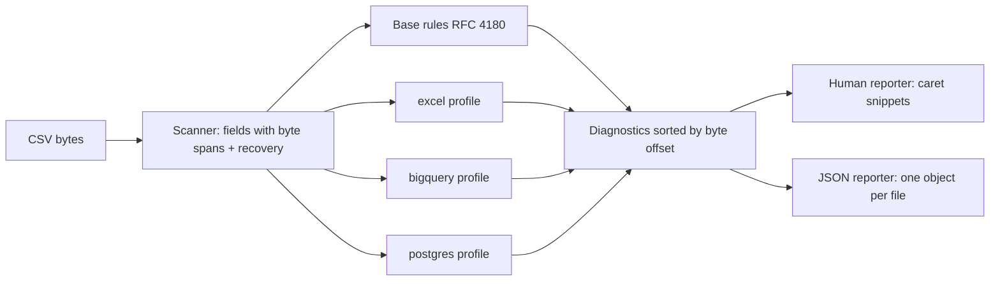

# csvstrict

[English](README.md) | [中文](README.zh.md) | [日本語](README.ja.md)

[](LICENSE) [](Cargo.toml)  [](CONTRIBUTING.md)

**オープンソースの厳格な CSV リンター — RFC 4180 に加え Excel・BigQuery・Postgres COPY の消費側プロファイルを備え、すべての指摘を正確なバイト位置に紐付ける。**


```bash
git clone https://github.com/JaydenCJ/csvstrict.git && cargo install --path csvstrict
```

> プレリリース版：crates.io にはまだ公開していません。上記の手順でソースからインストールしてください。

## なぜ csvstrict？

文脈ゼロの「BigQuery rejected row 48201」はデータエンジニアの通過儀礼です。どこでも開けるのに Excel だけで壊れるファイル、途中で黙って止まる Postgres COPY も同様。既存のリンターはあまり役に立ちません：csvlint はメンテナンスが止まっており、しかも「正しい CSV」という単一の普遍的な概念だけを検査します——それ自体がフィクションです。RFC 4180 に完全準拠していても、BigQuery には拒否され（クォート内改行）、Excel には壊され（先頭ゼロ、`=SUM`、`ID` で始まる SYLK の罠）、COPY には切り詰められる（単独行の `\.`）ことがあります。csvstrict は*実際にロードする先の消費側*に対して検査し、すべての指摘を正確なバイトに紐付けてキャレットで指し示します——3 行上の閉じ忘れた引用符こそが 48201 行目を壊した真犯人、という定番のケースも含めて。

|  | csvstrict | csvlint (Go) | csvkit csvclean | frictionless |
|---|---|---|---|---|
| 消費側プロファイル（Excel / BigQuery / Postgres COPY） | あり | なし | なし | なし（汎用スキーマ検査のみ） |
| エラー位置 | バイトオフセット + 行:列 + キャレット付き抜粋 | 行番号のみ | 行番号のみ | 行/フィールド番号 |
| 引用符 1 つの欠落 = 指摘 1 件 | はい（スキャナが回復） | ファイル末尾まで連鎖 | ファイルを書き換えてしまう | 連鎖 |
| 消費側が何をするかの説明 | あり（`explain PG002`） | なし | なし | なし |
| ランタイム依存 | 0 — 単一の静的バイナリ | Go モジュールツリー | Python + csvkit 一式 | Python + 巨大な依存ツリー |
| メンテナンス | 活発 | アーカイブ済み | 活発 | 活発 |

## 特徴

- **行番号ではなく正確なバイト** — すべての診断がバイトオフセット・行・列・レコード番号・フィールド番号を持ち、人間向け出力は問題のバイトの真下にキャレットを描画（文字単位で整列、マルチバイト安全、長い行はウィンドウ表示）。
- **プロファイルを意識したルール** — 同じバイト列でも消費側ごとに判定が変わります：単独行の `\.` は Excel には無害でも Postgres COPY ではテーブルの残りを落とし、クォート内改行は RFC 4180 的に合法でもデフォルトの `bq load` は失敗します。4 プロファイルで 32 の登録コード。
- **引用符 1 つの欠落 = 診断 1 件** — スキャナは問題のバイトで回復して連鎖させないため、レポートはファイル最終行ではなく本当のミスを指します。
- **全コードに解説付き** — `csvstrict explain XLS003` は消費側が実際に何をするか（エラー文言込み）と直し方を教え、`csvstrict profiles` は全チェックを一覧します。
- **設計から CI 向き** — 終了コード 0/1/2、`--deny-warnings`、`--max-diagnostics`、`--quiet`、`-` による stdin、入力ごとに機械可読オブジェクトを 1 つ出す `--format json`。
- **依存ゼロ・完全オフライン** — std のみの Rust。ネットワークなし、テレメトリなし。渡されたファイルを読むだけです。

## クイックスタート

インストール（Rust 1.75+ が必要）：

```bash
git clone https://github.com/JaydenCJ/csvstrict.git && cargo install --path csvstrict
```

Postgres に投入予定のファイルを検査：

```bash
csvstrict check -p postgres examples/postgres-traps.csv
```

出力（実際の実行から採取）：

```text
examples/postgres-traps.csv:3:1: error PG002 [postgres]: line contains only "\.", COPY's end-of-data marker: the 3 record(s) after this line are dropped or the load errors; quote the value as "\." to keep it (record 3, field 1)
     3 | \.
       | ^^

examples/postgres-traps.csv:3:3: error RFC201 [rfc4180]: record 3 has 1 field(s), expected 3 from the header (record 3, field 1)
     3 | \.
       |   ^

examples/postgres-traps.csv:6:3: info PG005 [postgres]: quoted empty field (loads as empty string) while the file also has unquoted empty fields (load as NULL), e.g. at byte 59; pick one convention or use FORCE_NULL / FORCE_NOT_NULL (record 6, field 2)
     6 | 4,"",0
       |   ^^

examples/postgres-traps.csv: 2 error(s), 0 warning(s), 1 info(s) — 6 record(s), 16 field(s) checked [profiles: rfc4180, postgres]
```

同じバイト列、違う消費側、違う判定——パイプライン向けの機械可読出力もあります：

```bash
csvstrict check -p excel,bigquery,postgres -q examples/clean.csv
csvstrict check -f json -p postgres examples/postgres-traps.csv | head -c 200
```

```text
examples/clean.csv: OK — 4 record(s), 16 field(s) checked [profiles: rfc4180, excel, bigquery, postgres]
{"tool":"csvstrict","version":"0.1.0","path":"examples/postgres-traps.csv","profiles":["rfc4180","postgres"],"summary":{"records":6,"fields":16,"errors":2,"warnings":0,"infos":1},"diagnostics":[{"code"
```

## プロファイル

RFC 4180 の基本チェックは常に実行され、`-p` で消費側を追加します。32 コードの逐条リファレンスは [docs/diagnostics.md](docs/diagnostics.md)、または `csvstrict explain <CODE>` を。

| プロファイル | 捕捉する問題の例 |
|---|---|
| `rfc4180` | 未終端/未エスケープ/裸の引用符、フィールド数のずれ、空行、重複ヘッダー、NUL、不正な UTF-8、CR/LF 規約、BOM |
| `excel` | 32,767 文字セルの切り詰め、`=`/`@`/`+`/`-` の数式インジェクション、先頭 `ID` の SYLK の罠、16,384 列 / 1,048,576 行の上限、BOM なし文字化け、先頭ゼロの消失 |
| `bigquery` | クォート内改行（`allow_quoted_newlines` が必要）、100 MB セル上限、非 UTF-8 ロード、自動検出にリネームされる列名、NUL |
| `postgres` | データ終端マーカー `\.`、NUL、不正な UTF-8、63 バイトの識別子切り詰め、NULL と `""` の曖昧さ、先頭列に混入する BOM |

## CLI リファレンス

| フラグ | 既定値 | 効果 |
|---|---|---|
| `-p, --profile <LIST>` | `rfc4180` | カンマ区切りの消費側プロファイル：`rfc4180`、`excel`、`bigquery`、`postgres` |
| `-f, --format <FMT>` | `human` | `human`（キャレット付き抜粋）または `json`（入力ファイルごとに 1 オブジェクト） |
| `-d, --delimiter <CHAR>` | `,` | 1 バイトのフィールド区切り。タブは `\t` で指定 |
| `--no-header` | オフ | 先頭レコードをデータとして扱い、ヘッダー検査を省略 |
| `--max-diagnostics <N>` | `200` | ファイルごとの診断表示数の上限（集計値は正確なまま） |
| `--deny-warnings` | オフ | エラーだけでなく警告でも終了コード 1 を返す |
| `-q, --quiet` | オフ | ファイルごとのサマリー行だけを表示 |

終了コード：`0` エラーなし、`1` エラー 1 件以上（`--deny-warnings` 時は警告も）、`2` 使い方/IO の問題。このリポジトリは CI を持ちません。上記の主張はすべてローカルでの `cargo test`（93 テスト）と `scripts/smoke.sh` の実行で検証しています。

## アーキテクチャ



## ロードマップ

- [x] コアリンター：バイト精度で回復可能な RFC 4180 スキャナ、Excel/BigQuery/Postgres COPY プロファイル、キャレット付き抜粋、JSON レポーター、`explain`/`profiles` コマンド
- [ ] プロファイル追加：Snowflake `COPY INTO`、Redshift、MySQL `LOAD DATA`、pandas `read_csv`
- [ ] 機械的修復を行う `fix` サブコマンド（行末、BOM、引用符のパディング、空行）
- [ ] メモリに収まらないファイル向けのストリーミングモード
- [ ] 「不正な UTF-8」で終わらないエンコーディング検出ヒント（Windows-1252 / Shift_JIS）

全リストは [open issues](https://github.com/JaydenCJ/csvstrict/issues) を参照してください。

## コントリビュート

貢献を歓迎します — [CONTRIBUTING.md](CONTRIBUTING.md) を読み、[good first issue](https://github.com/JaydenCJ/csvstrict/issues?q=is%3Aissue+is%3Aopen+label%3A%22good+first+issue%22) から始めるか、[discussion](https://github.com/JaydenCJ/csvstrict/discussions) を開いてください。

## ライセンス

[MIT](LICENSE)
