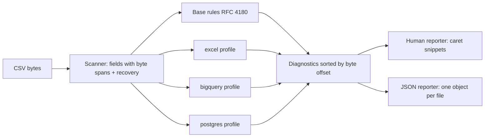

# csvstrict

[English](README.md) | [中文](README.zh.md) | [日本語](README.ja.md)

[](LICENSE) [](Cargo.toml)  [](CONTRIBUTING.md)

**An open-source strict CSV linter — RFC 4180 plus consumer profiles for Excel, BigQuery and Postgres COPY, every finding anchored to the exact byte.**


```bash
git clone https://github.com/JaydenCJ/csvstrict.git && cargo install --path csvstrict
```

> Pre-release: not yet on crates.io; install from source as above.

## Why csvstrict?

"BigQuery rejected row 48201" with no context is a rite of passage for data engineers — as is the spreadsheet that opens fine everywhere except Excel, and the Postgres COPY that silently stops halfway through the file. The existing linters don't help much: csvlint is abandoned and checks a single universal notion of "valid CSV", which is a fiction — a file can be perfectly RFC 4180 conformant and still be rejected by BigQuery (quoted newline), mangled by Excel (leading zeros, `=SUM`, the `ID` SYLK trap) or truncated by COPY (a lone `\.` line). csvstrict lints against *the consumer you are actually loading into*, and anchors every finding to the exact byte, with a caret under it — including the classic case where one missing quote three lines up is what actually broke row 48201.

|  | csvstrict | csvlint (Go) | csvkit csvclean | frictionless |
|---|---|---|---|---|
| Consumer profiles (Excel / BigQuery / Postgres COPY) | yes | no | no | no (generic schema checks) |
| Error position | byte offset + line:col + caret snippet | line number | row number | row/field number |
| One missing quote = one finding | yes (scanner recovers) | cascades to EOF | rewrites the file instead | cascades |
| Explains what the consumer will do | yes (`explain PG002`) | no | no | no |
| Runtime dependencies | 0 — single static binary | Go module tree | Python + csvkit stack | Python + large dep tree |
| Maintained | active | archived | active | active |

## Features

- **The exact byte, not just the row** — every diagnostic carries byte offset, line, column, record and field, and the human reporter draws a caret under the offending bytes (character-aligned, multibyte-safe, windowed for long lines).
- **Profile-aware rules** — the same bytes get different verdicts per consumer: `\.` on its own line is fine for Excel but drops the rest of your table under Postgres COPY; a quoted newline is legal RFC 4180 but fails a default `bq load`. 32 registered codes across 4 profiles.
- **One missing quote = one diagnostic** — the scanner recovers at the offending byte instead of cascading, so the report points at the actual mistake, not at the last line of the file.
- **Every code is explained** — `csvstrict explain XLS003` tells you what the consumer actually does (message text included) and how to fix it; `csvstrict profiles` lists all checks.
- **CI-friendly by construction** — exit codes 0/1/2, `--deny-warnings`, `--max-diagnostics`, `--quiet`, stdin via `-`, and `--format json` emitting one machine-readable object per input.
- **Zero dependencies, fully offline** — std-only Rust, no network, no telemetry; it only ever reads the files you pass it.

## Quickstart

Install (requires Rust 1.75+):

```bash
git clone https://github.com/JaydenCJ/csvstrict.git && cargo install --path csvstrict
```

Lint a file destined for Postgres:

```bash
csvstrict check -p postgres examples/postgres-traps.csv
```

Output (captured from a real run):

```text
examples/postgres-traps.csv:3:1: error PG002 [postgres]: line contains only "\.", COPY's end-of-data marker: the 3 record(s) after this line are dropped or the load errors; quote the value as "\." to keep it (record 3, field 1)
     3 | \.
       | ^^

examples/postgres-traps.csv:3:3: error RFC201 [rfc4180]: record 3 has 1 field(s), expected 3 from the header (record 3, field 1)
     3 | \.
       |   ^

examples/postgres-traps.csv:6:3: info PG005 [postgres]: quoted empty field (loads as empty string) while the file also has unquoted empty fields (load as NULL), e.g. at byte 59; pick one convention or use FORCE_NULL / FORCE_NOT_NULL (record 6, field 2)
     6 | 4,"",0
       |   ^^

examples/postgres-traps.csv: 2 error(s), 0 warning(s), 1 info(s) — 6 record(s), 16 field(s) checked [profiles: rfc4180, postgres]
```

Same bytes, different consumer, different verdict — and machine-readable output for pipelines:

```bash
csvstrict check -p excel,bigquery,postgres -q examples/clean.csv
csvstrict check -f json -p postgres examples/postgres-traps.csv | head -c 200
```

```text
examples/clean.csv: OK — 4 record(s), 16 field(s) checked [profiles: rfc4180, excel, bigquery, postgres]
{"tool":"csvstrict","version":"0.1.0","path":"examples/postgres-traps.csv","profiles":["rfc4180","postgres"],"summary":{"records":6,"fields":16,"errors":2,"warnings":0,"infos":1},"diagnostics":[{"code"
```

## Profiles

The RFC 4180 base checks always run; add consumers with `-p`. Full code-by-code reference (32 codes) in [docs/diagnostics.md](docs/diagnostics.md), or run `csvstrict explain <CODE>`.

| Profile | Catches, among other things |
|---|---|
| `rfc4180` | Unterminated/unescaped/bare quotes, field-count drift, blank lines, duplicate headers, NULs, invalid UTF-8, CR/LF conventions, BOM |
| `excel` | 32,767-char cell truncation, `=`/`@`/`+`/`-` formula injection, the leading-`ID` SYLK trap, 16,384-column / 1,048,576-row limits, BOM-less mojibake, leading-zero stripping |
| `bigquery` | Quoted newlines (need `allow_quoted_newlines`), 100 MB cell limit, non-UTF-8 loads, column names auto-detection renames, NULs |
| `postgres` | The `\.` end-of-data marker, NULs, invalid UTF-8, 63-byte identifier truncation, NULL vs `""` ambiguity, BOM-in-first-column |

## CLI reference

| Flag | Default | Effect |
|---|---|---|
| `-p, --profile <LIST>` | `rfc4180` | Comma-separated consumer profiles: `rfc4180`, `excel`, `bigquery`, `postgres` |
| `-f, --format <FMT>` | `human` | `human` (caret snippets) or `json` (one object per input file) |
| `-d, --delimiter <CHAR>` | `,` | Single-byte field delimiter; `\t` accepted for tabs |
| `--no-header` | off | Treat the first record as data; header checks are skipped |
| `--max-diagnostics <N>` | `200` | Cap printed diagnostics per file (totals stay exact) |
| `--deny-warnings` | off | Exit 1 on warnings, not only errors |
| `-q, --quiet` | off | Print only the per-file summary line |

Exit codes: `0` no errors, `1` at least one error (or warning with `--deny-warnings`), `2` usage/I-O problem. This repository ships no CI; every claim above is verified by local runs of `cargo test` (93 tests) and `scripts/smoke.sh`.

## Architecture



## Roadmap

- [x] Core linter: byte-precise RFC 4180 scanner with recovery, Excel/BigQuery/Postgres COPY profiles, caret snippets, JSON reporter, `explain`/`profiles` commands
- [ ] More profiles: Snowflake `COPY INTO`, Redshift, MySQL `LOAD DATA`, pandas `read_csv`
- [ ] `fix` subcommand for mechanical repairs (line endings, BOM, quote padding, blank lines)
- [ ] Streaming mode for files larger than memory
- [ ] Encoding detection hints (Windows-1252 / Shift_JIS) beyond plain "invalid UTF-8"

See the [open issues](https://github.com/JaydenCJ/csvstrict/issues) for the full list.

## Contributing

Contributions are welcome — see [CONTRIBUTING.md](CONTRIBUTING.md), start with a [good first issue](https://github.com/JaydenCJ/csvstrict/issues?q=is%3Aissue+is%3Aopen+label%3A%22good+first+issue%22) or open a [discussion](https://github.com/JaydenCJ/csvstrict/discussions).

## License

[MIT](LICENSE)
