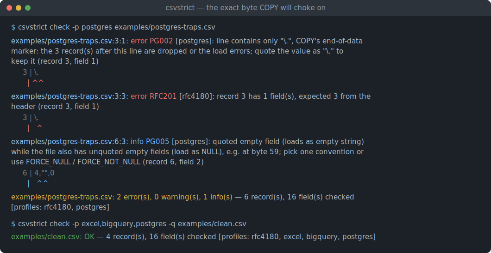
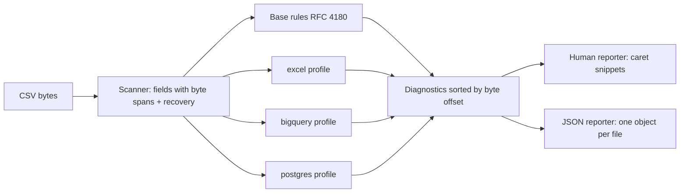

# csvstrict

[English](README.md) | [中文](README.zh.md) | [日本語](README.ja.md)

[](LICENSE) [](Cargo.toml)  [](CONTRIBUTING.md)

**开源的严格 CSV linter —— RFC 4180 加上 Excel、BigQuery、Postgres COPY 消费方 profile，每条发现都锚定到精确的字节位置。**



```bash
git clone https://github.com/JaydenCJ/csvstrict.git && cargo install --path csvstrict
```

> 预发布版本：尚未上架 crates.io，请按上面的方式从源码安装。

## 为什么选 csvstrict？

"BigQuery rejected row 48201"、没有任何上下文——这是每个数据工程师的必经之路；同样常见的还有到处都能打开、唯独 Excel 打不开的表格，以及默默在文件中途停下的 Postgres COPY。现有的 linter 帮不上什么忙：csvlint 已停止维护，且只检查一种放之四海皆准的"合法 CSV"概念——这本身就是虚构的：一个文件可以完全符合 RFC 4180，却仍被 BigQuery 拒绝（带引号的换行）、被 Excel 弄坏（前导零、`=SUM`、`ID` 开头的 SYLK 陷阱）、或被 COPY 截断（单独一行的 `\.`）。csvstrict 针对*你实际要导入的那个消费方*做检查，并把每条发现锚定到精确的字节、在其下方画出脱字符——包括那个经典场景：真正弄坏第 48201 行的，是三行之前缺失的一个引号。

|  | csvstrict | csvlint (Go) | csvkit csvclean | frictionless |
|---|---|---|---|---|
| 消费方 profile（Excel / BigQuery / Postgres COPY） | 有 | 无 | 无 | 无（仅通用 schema 校验） |
| 错误定位 | 字节偏移 + 行:列 + 脱字符片段 | 仅行号 | 仅行号 | 行/字段号 |
| 一个缺失引号 = 一条发现 | 是（扫描器可恢复） | 级联到文件末尾 | 直接改写文件 | 级联 |
| 解释消费方会怎么做 | 有（`explain PG002`） | 无 | 无 | 无 |
| 运行时依赖 | 0 —— 单个静态二进制 | Go 模块树 | Python + csvkit 全家桶 | Python + 庞大依赖树 |
| 维护状态 | 活跃 | 已归档 | 活跃 | 活跃 |

## 特性

- **精确到字节，而不只是行号** —— 每条诊断都带字节偏移、行、列、记录号和字段号，人类可读输出在出错字节下方画脱字符（按字符对齐、多字节安全、长行自动开窗）。
- **profile 感知的规则** —— 同样的字节在不同消费方下得到不同结论：单独一行的 `\.` 对 Excel 无害，但在 Postgres COPY 下会丢掉表的剩余部分；带引号的换行完全符合 RFC 4180，却会让默认的 `bq load` 失败。4 个 profile 共 32 个注册代码。
- **一个缺失引号 = 一条诊断** —— 扫描器在出错字节处恢复而不是级联报错，报告指向真正的错误，而不是文件最后一行。
- **每个代码都有解释** —— `csvstrict explain XLS003` 告诉你消费方到底会做什么（含其报错原文）以及怎么修；`csvstrict profiles` 列出全部检查。
- **天生适合 CI** —— 退出码 0/1/2、`--deny-warnings`、`--max-diagnostics`、`--quiet`、通过 `-` 读 stdin，以及每个输入产出一个机器可读对象的 `--format json`。
- **零依赖、完全离线** —— 纯 std 的 Rust，无网络、无遥测；它只读取你传给它的文件。

## 快速上手

安装（需要 Rust 1.75+）：

```bash
git clone https://github.com/JaydenCJ/csvstrict.git && cargo install --path csvstrict
```

检查一个要导入 Postgres 的文件：

```bash
csvstrict check -p postgres examples/postgres-traps.csv
```

输出（截取自真实运行）：

```text
examples/postgres-traps.csv:3:1: error PG002 [postgres]: line contains only "\.", COPY's end-of-data marker: the 3 record(s) after this line are dropped or the load errors; quote the value as "\." to keep it (record 3, field 1)
     3 | \.
       | ^^

examples/postgres-traps.csv:3:3: error RFC201 [rfc4180]: record 3 has 1 field(s), expected 3 from the header (record 3, field 1)
     3 | \.
       |   ^

examples/postgres-traps.csv:6:3: info PG005 [postgres]: quoted empty field (loads as empty string) while the file also has unquoted empty fields (load as NULL), e.g. at byte 59; pick one convention or use FORCE_NULL / FORCE_NOT_NULL (record 6, field 2)
     6 | 4,"",0
       |   ^^

examples/postgres-traps.csv: 2 error(s), 0 warning(s), 1 info(s) — 6 record(s), 16 field(s) checked [profiles: rfc4180, postgres]
```

同样的字节、不同的消费方、不同的结论——还有面向流水线的机器可读输出：

```bash
csvstrict check -p excel,bigquery,postgres -q examples/clean.csv
csvstrict check -f json -p postgres examples/postgres-traps.csv | head -c 200
```

```text
examples/clean.csv: OK — 4 record(s), 16 field(s) checked [profiles: rfc4180, excel, bigquery, postgres]
{"tool":"csvstrict","version":"0.1.0","path":"examples/postgres-traps.csv","profiles":["rfc4180","postgres"],"summary":{"records":6,"fields":16,"errors":2,"warnings":0,"infos":1},"diagnostics":[{"code"
```

## Profile 一览

RFC 4180 基础检查总是执行；用 `-p` 追加消费方。32 个代码的逐条参考见 [docs/diagnostics.md](docs/diagnostics.md)，或运行 `csvstrict explain <CODE>`。

| Profile | 能抓到的问题（部分） |
|---|---|
| `rfc4180` | 未闭合/未转义/裸引号、字段数漂移、空行、重复表头、NUL、非法 UTF-8、CR/LF 约定、BOM |
| `excel` | 32,767 字符单元格截断、`=`/`@`/`+`/`-` 公式注入、`ID` 开头的 SYLK 陷阱、16,384 列 / 1,048,576 行上限、无 BOM 乱码、前导零丢失 |
| `bigquery` | 带引号的换行（需要 `allow_quoted_newlines`）、100 MB 单元格上限、非 UTF-8 载入、会被自动检测改名的列名、NUL |
| `postgres` | `\.` 数据结束标记、NUL、非法 UTF-8、63 字节标识符截断、NULL 与 `""` 的歧义、混进首列的 BOM |

## CLI 参考

| 参数 | 默认值 | 作用 |
|---|---|---|
| `-p, --profile <LIST>` | `rfc4180` | 逗号分隔的消费方 profile：`rfc4180`、`excel`、`bigquery`、`postgres` |
| `-f, --format <FMT>` | `human` | `human`（脱字符片段）或 `json`（每个输入文件一个对象） |
| `-d, --delimiter <CHAR>` | `,` | 单字节字段分隔符；`\t` 表示制表符 |
| `--no-header` | 关 | 把第一条记录当数据处理，跳过表头检查 |
| `--max-diagnostics <N>` | `200` | 每个文件最多打印的诊断数（统计数保持精确） |
| `--deny-warnings` | 关 | 警告也返回退出码 1，而不仅是错误 |
| `-q, --quiet` | 关 | 只打印每个文件的汇总行 |

退出码：`0` 无错误，`1` 至少一个错误（或加 `--deny-warnings` 后的警告），`2` 用法/IO 问题。本仓库不带 CI；上面的每一条声明都由本地运行 `cargo test`（93 个测试）和 `scripts/smoke.sh` 验证。

## 架构



## 路线图

- [x] 核心 linter：字节级精确、可恢复的 RFC 4180 扫描器，Excel/BigQuery/Postgres COPY profile，脱字符片段，JSON 报告器，`explain`/`profiles` 命令
- [ ] 更多 profile：Snowflake `COPY INTO`、Redshift、MySQL `LOAD DATA`、pandas `read_csv`
- [ ] `fix` 子命令做机械修复（行尾、BOM、引号填充、空行）
- [ ] 面向超出内存文件的流式模式
- [ ] 编码检测提示（Windows-1252 / Shift_JIS），不止于一句"非法 UTF-8"

完整列表见 [open issues](https://github.com/JaydenCJ/csvstrict/issues)。

## 参与贡献

欢迎贡献——请阅读 [CONTRIBUTING.md](CONTRIBUTING.md)，从一个 [good first issue](https://github.com/JaydenCJ/csvstrict/issues?q=is%3Aissue+is%3Aopen+label%3A%22good+first+issue%22) 开始，或发起一个 [discussion](https://github.com/JaydenCJ/csvstrict/discussions)。

## 许可证

[MIT](LICENSE)
